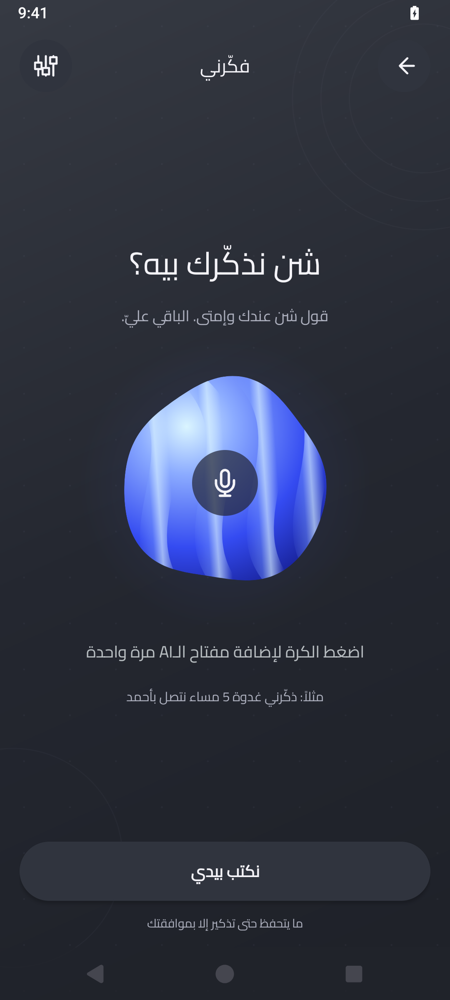
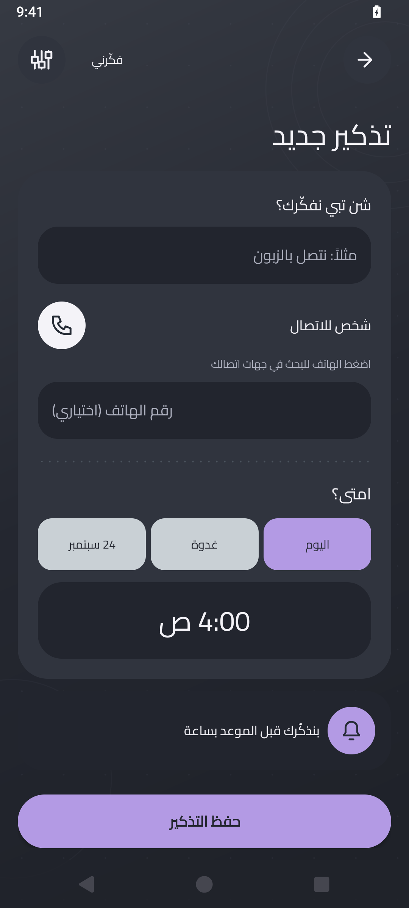
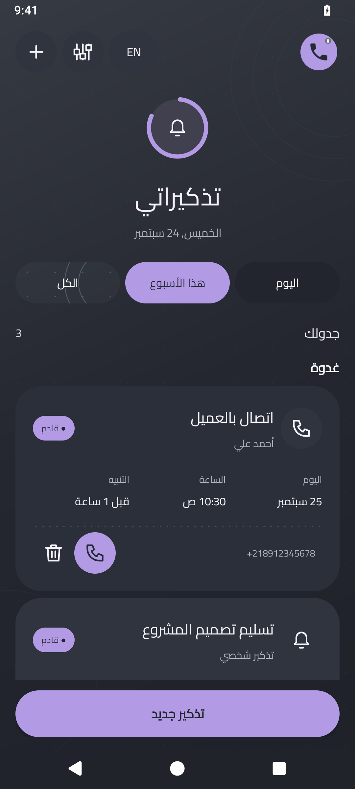

<div align="center">

# فكّرني
### قول شن عندك… وفكّرني يتولّى الباقي.

مساعد تذكيرات خفيف للأندرويد، يفهم كلامك العربي الليبي ويجهّز الموعد للمراجعة — بإشعار قبلها بساعة.

[](#التثبيت)
[](https://github.com/mohamedkbay/fakkerni/releases/latest)
[](https://github.com/mohamedkbay/fakkerni/releases/latest/download/fakkerni.apk)

**[تنزيل آخر نسخة](https://github.com/mohamedkbay/fakkerni/releases/latest/download/fakkerni.apk)** · **[كل الإصدارات](https://github.com/mohamedkbay/fakkerni/releases)** · **[الإبلاغ عن مشكلة](https://github.com/mohamedkbay/fakkerni/issues)**

<br />


**1.4.0** — واجهة المساعد الجديدة بالأبيض والأسود وزر تسجيل تحت المجسّم المتحرك.

</div>

---

## تكلّم. راجع. وافق.

> «غدوة الساعة 5 العشية ذكّرني نتصل بأحمد.»

1. **تكلّم:** المساعد يفتح أولاً. اضغط مطوّلًا زر الميكروفون أسفل الشكل، وسيب الزر لتحويل الصوت.
2. **راجع:** النص بالعربي، مع اقتراح المهمة والموعد والشخص. تقدر تصلّح أي شيء بيدك.
3. **وافق:** لا يُحفظ التذكير إلا بموافقتك. التنبيه قبل الموعد بـ1 ساعة.

التسجيل حتى 60 ثانية. تقدر تختار **«نكتب بيدي»** بدون مفتاح AI أو إنترنت.

## شاشات هادئة، وخطوات قليلة

<table>
<tr>
<th>المساعد الصوتي</th>
<th>الكتابة والمراجعة</th>
<th>تذكيراتك</th>
</tr>
<tr>
<td></td>
<td></td>
<td></td>
</tr>
</table>

الصور و[جولة GIF](docs/media/app-tour.gif) أرشيفية من واجهة 1.3؛ لا تمثّل التصميم الجديد في 1.4.0. لم تتوفر لقطة فعلية للإصدار الجديد من المحاكي على جهاز البناء.

## شن يقدر يدير؟

| الميزة | التفاصيل |
| --- | --- |
| صوت عربي ليبي | Groq يحوّل الكلام لنص ويقترح عنواناً عربياً وموعداً. |
| جهات الاتصال | يبحث محلياً بالاسم العربي أو الإنجليزي أو جزء من الرقم؛ يملأ التطابق الوحيد في المسودة أو يطلب الاختيار عند التعدد. |
| تنبيهات واضحة | صوت المنبّه واهتزاز، مع تفاصيل الموعد على شاشة القفل حسب إعدادات الهاتف. |
| كتابة بدون إنترنت | الإضافة اليدوية والتذكيرات المحفوظة لا تحتاج AI أو حساباً. |
| واجهة بسيطة | عربي/إنجليزي، خط Cairo، أرقام `0–9` دائماً، ومظهر داكن أو فاتح، وأيقونات Morphicons متحركة. |

اسم التطبيق ثابت **فكّرني** حتى لو لغة الهاتف إنجليزية؛ تختار اسم المساعد عند أول فتح. لغة الصوت مثبتة على العربية، مستقلة عن لغة الواجهة.

## التثبيت

1. نزّل **[آخر APK](https://github.com/mohamedkbay/fakkerni/releases/latest/download/fakkerni.apk)** على هاتف Android 8 أو أحدث.
2. وافق على التثبيت من المصدر عند طلب Android. للتحديث، ثبّت فوق النسخة الحالية **بدون حذفها**.
3. اسمح بالإشعارات و«المنبّهات والتذكيرات» الدقيقة، ثم جرّب زر **«جرّب بعد 10 ثواني»** واقفل الشاشة.

الإصدار الحالي **1.4.0**. ملفات الإصدار تشمل APK وبصمة SHA-256 للتحقق.

> **مهم:** الصوت وشاشة القفل يخضعان لإعدادات Android، صوت المنبّه، عدم الإزعاج وقيود البطارية. التطبيق لا يتجاوزها ولا يضمن إضاءة الشاشة. إذا التنبيهات تعمل، لا تغيّر إعدادات البطارية بلا حاجة.

## ربط Groq مرة واحدة

1. أنشئ مفتاحك في [Groq Console](https://console.groq.com/keys).
2. فعّل النموذجين في [إعدادات المشروع](https://console.groq.com/settings/project/limits): `whisper-large-v3-turbo` للصوت و`openai/gpt-oss-20b` لفهم الموعد.
3. من إعدادات فكّرني اختَر **Groq ← إضافة المفتاح** واحفظه.

لا تنشر المفتاح في Issues أو الصور أو الكود. الخطة المجانية لها [حدود استخدام](https://console.groq.com/docs/rate-limits)، وليست غير محدودة. الإشعارات والإدخال اليدوي لا يستهلكان Groq.

يوجد خيار **OpenAI** أيضاً بمفتاح منفصل؛ رصيد API مستقل عن اشتراك ChatGPT. لا ينتقل التطبيق إلى مزوّد آخر تلقائياً عند الخطأ.

## الخصوصية وحدود الذكاء الاصطناعي

- **مفتاحك على هاتفك:** مشفّر باستخدام Android Keystore، مستثنى من النسخ الاحتياطي، وغير مضمّن في APK.
- **الصوت والنص فقط للمزوّد المختار:** بما فيهما الأسماء والأرقام التي تنطقها. دليل جهات الاتصال وبقية التذكيرات لا يُرفعان.
- **الميكروفون في المقدمة:** مغادرة الشاشة توقف التسجيل دون رفعه تلقائياً. الإلغاء يحذف التسجيل المحلي؛ الإيقاف القسري قد يترك ملفاً مؤقتاً في cache.
- **أنت توافق دائماً:** AI يجهّز مسودة واحدة؛ الموعد الغامض أو المتكرر أو تعدد المهام يحتاج مراجعة يدوية. زر الاتصال يفتح لوحة الاتصال ولا يجري المكالمة تلقائياً.
- **شاشة القفل:** إظهار المحتوى قد يجعل التذكير مقروءاً للآخرين؛ تحكّم به من إعدادات الهاتف.

## للمطورين

تطبيق **Android أصلي بلغة Java**، بدون WebView. الأيقونات تُجهّز بمكتبة npm ثم تُرسم محلياً داخل التطبيق.

**المتطلبات:** JDK 17، Android SDK 36، Build Tools 35.0.0. يستخدم المشروع Gradle Wrapper 8.9.

```bash
git clone https://github.com/mohamedkbay/fakkerni.git
cd fakkerni

# عرّف Android SDK عبر ANDROID_HOME أو local.properties
./gradlew :app:assembleDebug
./gradlew :app:testDebugUnitTest :app:lintDebug
```

الـAPK التجريبي: `app/build/outputs/apk/debug/app-debug.apk`.

لإعادة توليد الأيقونات فقط — الأصول الجاهزة موجودة بالفعل:

```bash
npm ci --ignore-scripts
npm run icons
```

لا تحتاج مفتاح API للبناء أو لاختبارات الوحدة. اختبارات الأجهزة داخل `app/src/androidTest` مخصصة لمحاكي تجريبي معزول، وبعضها يفترض بيانات/أذونات اختبار؛ لا تشغّلها على هاتفك الشخصي.

### التحقق

**34 اختبار وحدة** تغطي التواريخ والغموض، الأرقام، مطابقة الأسماء، استجابات Groq ولغة التفريغ. فحص Lint بلا أخطاء مانعة. لم يتوفر محاكي لاختبار واجهة 1.4.0 بصرياً. [تفاصيل الإصدار](docs/releases/v1.4.0.md).

### التوقيع والتراخيص

الـAPK الحالي موقّع بشهادة تطوير محلية، للتجربة الشخصية وليس إصدار متجر. مفاتيح التوقيع وملفات الجهاز غير منشورة. نسختك المبنية محلياً تحمل توقيعك، وقد لا تثبَّت كتحديث فوق APK المنشور.

- [Morphicons](https://www.npmjs.com/package/morphicons): [MIT](app/src/main/assets/MORPHICONS-LICENSE.txt).
- [Cairo](https://fonts.google.com/specimen/Cairo): [SIL Open Font License](docs/licenses/Cairo-OFL.txt).

لم يُحدَّد ترخيص عام لكود المشروع بعد؛ تراخيص مكونات الطرف الثالث محفوظة أعلاه.

---

<div align="center">
<strong>فكّرني — تذكيراتك، من غير تعقيد.</strong><br />
<sub>Native Android · Arabic-first voice · Cairo · Morphicons</sub>
</div>
